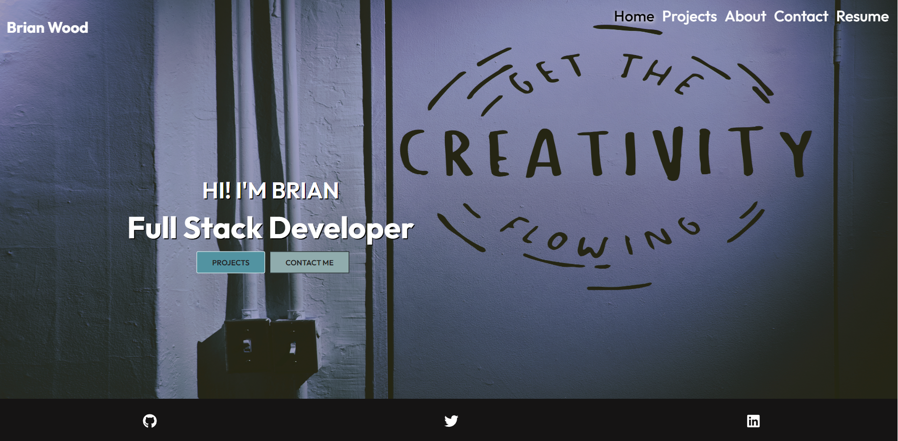

# My Portfolio

My personal portfolio designed during UW Wisconsin Full Stack Coding Boot Camp

## App Details
- A single-page application portfolio 
- When the user loads the portfolio they are presented with a page containing a header, a section for content, and a footer
- When the user views the header they are presented with the developer's name and navigation with titles corresponding to different sections of the portfolio
- When the user views the navigation titles they are presented with the titles About Me, Portfolio, Contact, and Resume, and the title corresponding to the current section is highlighted
- When the user clicks on a navigation title they are presented with the corresponding section below the navigation without the page reloading and that title is highlighted
- When the user load the portfolio the first time the About Me title and section are selected by default
- When the user is presented with the About Me section they see a recent photo or avatar of the developer and a short bio about them
- When the user is presented with the Portfolio section they see titled images of six of the developer’s applications with links to both the deployed applications and the corresponding GitHub repository
- When the user is presented with the Contact section they see a contact form with fields for a name, an email address, and a message
- When the user moves their cursor out of one of the form fields without entering text they receive a notification that this field is required
- When the user enters text into the email address field they receive a notification if they have entered an invalid email address
- When the user is presented with the Resume section they see a link to a downloadable resume and a list of the developer’s proficiencies
- When the user view the footer they are presented with text or icon links to the developer’s GitHub and LinkedIn profiles, and their profile on a third platform 
### Layout:

